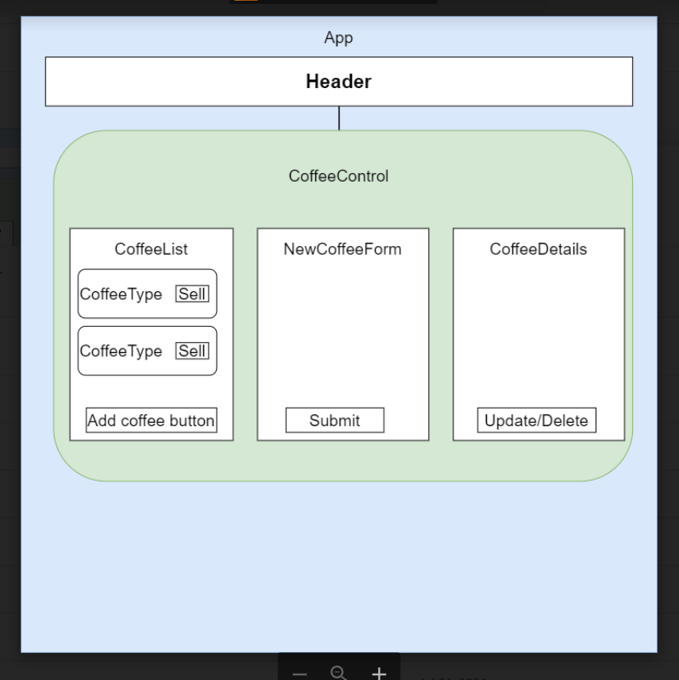
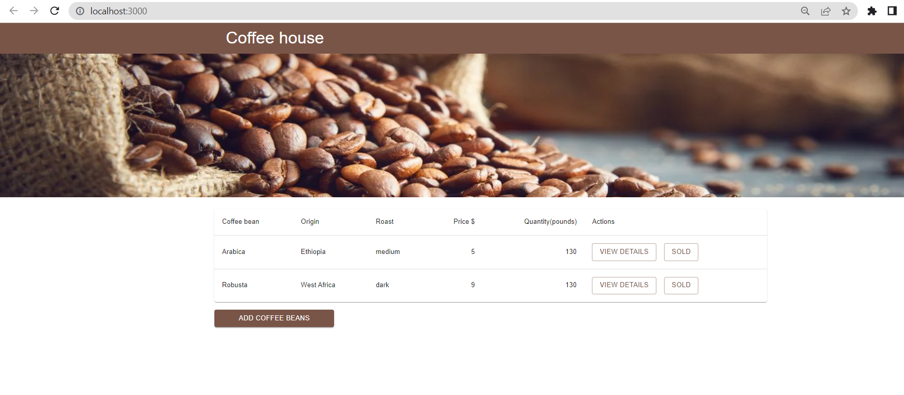

# Coffee shop

#### By: Viktoria Zubarieva

#### Description

Web application in React that tracks inventory for a local coffee shop business.
Web application contain CREATE, READ, and UPDATE functionality. The application has the following functionality:

As a user, I want to see a list/menu of all available types of coffee beans.
For each item, I want to see its name, origin, price, and roast (light, medium, or dark) of the coffee bean. (You are welcome to include anything additional that is relevant to the product your store carries.)
As a user, I want to submit a form to add a new burlap sack of coffee to the inventory.
As a user, I want to be able to click on a burlap sack to see its detail page.
As a user, I want to see how many pounds of coffee beans are left in a burlap sack. A burlap sack has roughly 130 pounds.
As a user, I want to be able to click a button to sell a pound of coffee beans. This should decrease the number of pounds left by 1. The number of pounds in a sack of coffee beans should not be able to go below 0.

## Technologies Used

- React
- JavaScript
- Material UI
-

## Setup/Installation Requirements

- _Clone repository from GitHub_
- _Open your terminal and run the command $ git clone https://github.com/vzubarieva/coffee-shop_
- Navigate to "coffee-shop": $ cd coffee-shop
- Open in code editor (VS Code)
- Install dependencies: $ npm install
- Run Program $ npm run start(It should open the server http://localhost:3000/ )

## Known Bugs

- add Delete functionality;
- add $ for price

## License

_MIT_

Copyright (c) _2022_ _Viktoriia Zubarieva_
